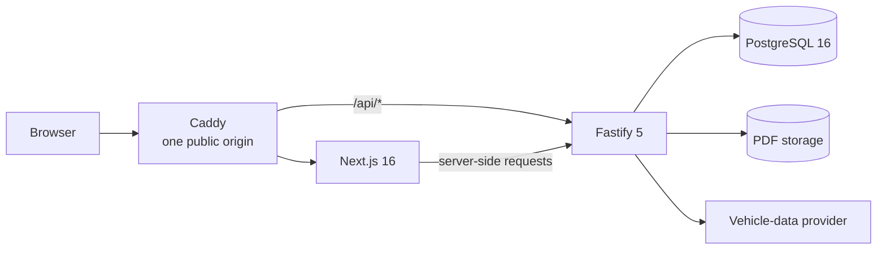

# 🔧 Verkstadssystem

**A full-stack management platform for a small independent Swedish car workshop.**

It combines a public website and booking flow with the daily tools a workshop
needs: customers, vehicles, scheduling, work orders, inventory, quotes, service
protocols, recommendations, audit trails and operational reporting.


> [!IMPORTANT]
> The project is under active development and is not yet ready for a production
> launch. The core workshop workflows are implemented; final integrations,
> frontend polish and production acceptance remain.

## ✨ What it does

### For customers

- Browse the workshop and its services in Swedish.
- Look up vehicle details by registration number.
- Send a booking request without being promised an unavailable time slot.
- Receive clear feedback when an external vehicle-data service is unavailable.

### For workshop staff

- Manage customers, vehicles and odometer history.
- Review online requests or create telephone bookings directly.
- Plan work in a mechanic-based calendar with collision protection.
- Run work orders from intake to completion.
- Track articles through an auditable stock ledger and stocktakes.
- Create versioned quotes and permanent service protocols with PDFs.
- Record service recommendations while keeping the final decision human.
- Search globally and monitor daily work from an admin dashboard.

### Built for real workshop risks

- Role-based access for administrators and mechanics.
- First-party sessions, CSRF protection and rate limits.
- Optimistic locking where two staff members could overwrite each other.
- Idempotent stock deduction and database-enforced booking exclusions.
- Audit logs, GDPR export/anonymisation and scheduled retention jobs.
- Tested backup/restore, deterministic document checks and load budgets.

## 🏗️ Architecture



The browser always uses the relative `/api` path. Caddy sends those requests to
the backend and everything else to Next.js, keeping session cookies first-party
and removing the need for CORS.

Shared Zod schemas, domain types and business rules are imported by both apps,
so the frontend and API use the same contract. Money is stored as integer öre,
containers run in UTC, and Swedish local-time conversion happens explicitly.

### Technology

| Area | Stack |
|---|---|
| Frontend | Next.js 16, React 19, Tailwind CSS 4, shadcn/ui, TanStack Query, React Hook Form, Motion |
| Backend | Node.js 22, Fastify 5, Prisma 7, PostgreSQL 16, Zod, Pino |
| Documents | `@react-pdf/renderer`, committed fonts, SHA-256 verification |
| Testing | Vitest, Testcontainers, Playwright, strict type coverage |
| Operations | Docker Compose, Caddy, scheduled jobs, backup and restore scripts |

## 📂 Repository layout

```text
.
├── frontend/       Next.js public site and admin panel
├── backend/        Fastify API, Prisma schema, jobs, PDFs and performance tools
├── shared/         Schemas, types and pure domain rules used by both apps
├── infra/          Docker Compose, Caddy, backup and restore tooling
├── docs/
│   ├── PROJECT_SPEC.md
│   ├── DECISIONS.md
│   └── proposals/
│       └── AI_DIAGNOSTICS_SPEC.md
│
└── CLAUDE.md       Working rules for coding agents and maintainers
```

<a id="phases"></a>

## 🗺️ Phases

The detailed milestone trackers are the source of truth. This table is the
short public overview.

| Phase | Scope | Status |
|---|---|---|
| 0 — Foundation | Monorepo, strict TypeScript, database, Docker and CI | 🚧 In progress — repository settings remain |
| 1 — Core data | Authentication, customers, vehicles and admin shell | ✅ Done |
| 2 — Inventory | Articles, stock ledger and stocktake | ✅ Done |
| 3 — Booking | Public site, requests, calendar, lookup and phone bookings | 🚧 In progress |
| 4 — Work | Work orders, stock deduction and dashboard | ✅ Done |
| 5 — Documents | Quotes, service protocols and PDFs | 🚧 In progress |
| 6 — Intelligence | Service rules, settings and real vehicle-data provider | 🚧 In progress |
| 7 — Hardening | Audit, GDPR, scheduled jobs, deployment and restore | ✅ Done |
| 8 — Polish | Admin workflow/design refresh, accessibility, performance and production acceptance | 🚧 In progress |

### Current snapshot

As of **2026-09-23**:

- Backend: **93/96 milestones**, with **12/15 iterations done**.
- Frontend: **66/96 milestones**, with **8/14 iterations done**. The twelve F13
  admin-redesign milestones are still open: its visual system, navigation shell
  and dashboard are built, and every milestone retains tasks that are not.
- The full backend, frontend and UI/UX audit records are linked under
  [Documentation](#documentation).
- AI-assisted diagnostics is a proposal only and is not part of the implemented
  product or frozen project scope.

<a id="getting-started"></a>

## 🚀 Getting started

### Prerequisites

- Node.js 22 (`.nvmrc` pins the tested version)
- pnpm 12
- Docker with Docker Compose

### First run

```bash
# Windows PowerShell: Copy-Item .env.example .env
cp .env.example .env

# Review the local values, then install dependencies.
# The prepare hook builds shared/ and generates the Prisma client.
pnpm install

# Start PostgreSQL on 127.0.0.1:5433.
docker compose -f infra/docker-compose.dev.yml --env-file .env up -d

# Apply migrations and create the development staff accounts.
pnpm --filter backend prisma:migrate
pnpm --filter backend prisma:seed

# Start the API and frontend in watch mode.
pnpm dev
```

The seed is development-only, idempotent and prints credentials for an
administrator and a mechanic. Placeholder secrets from `.env.example` work in
development but are rejected in production.

Once running:

- Public site and admin panel: <http://localhost:3000>
- Backend: <http://127.0.0.1:3001>
- Health: <http://127.0.0.1:3001/api/health>
- Readiness: <http://127.0.0.1:3001/api/health/ready>

## 🧰 Useful commands

| Command | Purpose |
|---|---|
| `pnpm dev` | Build `shared` and run all packages in watch mode |
| `pnpm build` | Build the complete workspace |
| `pnpm typecheck` | Type-check every package without emitting files |
| `pnpm lint` | Run ESLint with zero warnings allowed |
| `pnpm test` | Run unit and integration tests |
| `pnpm test:e2e` | Run the Playwright browser suite |
| `pnpm check` | Run type-checking, linting, tests and type coverage |
| `pnpm db:migrate` | Create and apply a Prisma migration |
| `pnpm db:studio` | Open Prisma Studio |

## 🚢 Production stack

```bash
docker compose -f infra/docker-compose.yml --project-directory . up -d --build
```

The production composition starts PostgreSQL, a one-shot migration service,
the backend, the frontend and Caddy. Only Caddy publishes ports to the host.
Before deployment, replace all development secrets, set the real `DOMAIN`,
configure persistent storage and choose an off-site backup destination.

```bash
infra/scripts/backup.sh
infra/scripts/restore.sh <db.dump.gz> <storage.tar.gz>
```

The restore path has been exercised end to end, including database records and
byte-identical stored PDFs. Operational details and verification evidence live
in the backend iteration tracker.

## 🧪 Engineering standards

- TypeScript is strict throughout the workspace; explicit `any` is banned.
- CI expects at least **99.5% type coverage**.
- Code, identifiers, commits and developer documentation are English.
- All user-facing product text is Swedish.
- Changes follow Conventional Commits, for example
  `feat(backend): add stock ledger`.
- `pnpm check` should pass before every commit.
- The complete Definition of Done is in `docs/PROJECT_SPEC.md` §10.

<a id="documentation"></a>

## 📚 Documentation

| Document | Purpose |
|---|---|
| [`docs/PROJECT_SPEC.md`](docs/PROJECT_SPEC.md) | Product requirements, domain rules and Definition of Done |
| [`docs/DECISIONS.md`](docs/DECISIONS.md) | Durable architecture and product decisions with their reasoning |
| [`backend/README.md`](backend/README.md) | Backend architecture, local workflow and engineering conventions |
| [`backend/IMPLEMENTATION_PLAN.md`](backend/IMPLEMENTATION_PLAN.md) | Backend milestones, active work and verification history |
| [`frontend/README.md`](frontend/README.md) | Frontend architecture, routes, design system and local workflow |
| [`frontend/IMPLEMENTATION_PLAN.md`](frontend/IMPLEMENTATION_PLAN.md) | Frontend milestones, active work and acceptance history |
| [`frontend/UI_UX_AUDIT.md`](frontend/UI_UX_AUDIT.md) | Completed cross-cutting UI and UX audit |
| [`frontend/ADMIN_PANEL_REDESIGN.md`](frontend/ADMIN_PANEL_REDESIGN.md) | F13 admin redesign: rationale, screen behavior, colors, contracts, acceptance criteria and what is built so far |
| [`backend/perf/README.md`](backend/perf/README.md) | Dataset, query audit, performance budgets and load harness |
| [`docs/proposals/AI_DIAGNOSTICS_SPEC.md`](docs/proposals/AI_DIAGNOSTICS_SPEC.md) | Proposed, not-yet-approved AI diagnostics feature |
| [`CLAUDE.md`](CLAUDE.md) | Implementation rules for coding agents and maintainers |

---

Built around the realities of a small workshop: phone calls still matter,
stock must reconcile, documents must remain trustworthy, and automation should
support a mechanic's judgement—not replace it. 🚗💨
