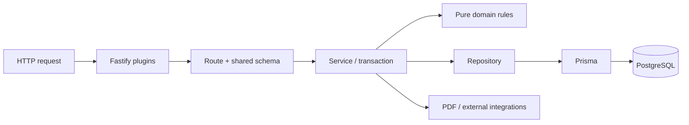

# ⚙️ Backend

The backend is a typed Fastify API for the workshop's operational workflows:
customers, vehicles, bookings, inventory, work orders, documents, service
recommendations, auditing and scheduled maintenance.

It runs on Node.js 22 with Prisma and PostgreSQL. Request and response contracts
come from the workspace's `shared` package, keeping validation and domain types
aligned with the frontend.

> [!NOTE]
> The detailed checklists, acceptance criteria and implementation history live
> in the [Backend implementation plan](IMPLEMENTATION_PLAN.md).

## 🚦 Status

**93/96 milestones complete · 12/15 iterations done**

| Remaining area | Progress | Blocker or next step |
|---|---:|---|
| [B0 — Foundation](IMPLEMENTATION_PLAN.md#b0) | 9/10 | Run CI on a pull request and configure branch protection |
| [B10 — Vehicle data](IMPLEMENTATION_PLAN.md#b10) | 5/6 | Connect the contracted real provider |
| [B13 — Release readiness](IMPLEMENTATION_PLAN.md#b13) | 5/6 | Verify the provider and production VPS |

See the plan's [status table](IMPLEMENTATION_PLAN.md#status) for the complete
iteration map.

## 🧭 Responsibilities

- Authenticate staff and enforce `ADMIN`/`MECHANIC` permissions.
- Manage customers, vehicles, odometer readings and global search.
- Receive public booking requests and manage direct staff bookings.
- Protect the calendar from overlapping mechanic assignments.
- Maintain articles through an append-only stock ledger.
- Run work orders with optimistic locking and idempotent stock effects.
- Create quotes, service protocols and verified PDF documents.
- Evaluate service rules while preserving human approval.
- Provide audit, privacy, retention, reconciliation and cleanup operations.
- Integrate vehicle-data providers behind a replaceable boundary.

## 🏗️ Request architecture



- **Routes** handle HTTP concerns and never access Prisma directly.
- **Services** coordinate business rules, transactions and side effects.
- **Repositories** contain database access.
- **Domain and shared modules** hold pure, testable logic.
- **Plugins** apply authentication, CSRF, security, request IDs and consistent
  error handling.

## 📂 Structure

```text
backend/
├── prisma/          Schema, migrations and development seed
├── src/
│   ├── config/      Validated environment configuration
│   ├── domain/      Backend-only pure business rules
│   ├── integrations/ Vehicle-data provider boundary
│   ├── jobs/        Scheduled and lock-protected maintenance jobs
│   ├── lib/         Prisma, logging, errors and shared infrastructure
│   ├── modules/     Routes, services and repositories by domain
│   ├── pdf/         Quote and service-protocol rendering
│   ├── plugins/     Fastify cross-cutting concerns
│   ├── app.ts       Fastify application assembly
│   └── server.ts    Runtime entry point
├── tests/           Cross-module integration and hardening tests
├── perf/            Dataset, query audit and load harness
└── Dockerfile       Production image
```

## 🚀 Running locally

Follow the repository [first-run guide](../README.md#getting-started) to create
`.env`, start PostgreSQL, apply migrations and seed staff accounts.

From the repository root:

```bash
# Recommended: builds shared and runs every package together
pnpm dev

# Backend only, after shared has been built
pnpm --filter shared build
pnpm --filter backend dev
```

The API listens on <http://127.0.0.1:3001> by default.

```bash
curl http://127.0.0.1:3001/api/health
curl http://127.0.0.1:3001/api/health/ready
```

## 🗄️ Database workflow

```bash
# Create and apply a development migration
pnpm --filter backend prisma:migrate

# Regenerate the Prisma client
pnpm --filter backend prisma:generate

# Seed development staff accounts
pnpm --filter backend prisma:seed

# Inspect local data
pnpm --filter backend prisma:studio
```

- Commit every migration together with the code that requires it.
- Use `prisma migrate dev` during development; never use `db push`.
- Review migrations for table locks and data-conversion risk.
- Production migrations run through the one-shot Compose migration service,
  never during application startup.

## 🔐 Configuration and security

All environment values are parsed at boot; malformed configuration stops the
process with a readable error. The complete template is
[`.env.example`](../.env.example).

Important groups include:

- PostgreSQL connection and development container credentials
- Session, form-token and IP-hash secrets
- Storage path and public base URL
- Vehicle-data provider selection and API credentials
- Proxy trust, logging and optional Sentry reporting

Production rejects development placeholder secrets. Browser requests reach the
API through Caddy on the same origin, keeping session cookies first-party.

## 🧪 Quality checks

```bash
pnpm --filter backend typecheck
pnpm --filter backend test
pnpm --filter backend test:coverage
pnpm --filter backend build

# Full workspace gate
pnpm check
```

Vitest covers pure rules, services and real HTTP routes. Integration tests use a
real PostgreSQL instance through Testcontainers where database behavior,
transactions or constraints matter.

Performance tooling and measured budgets are documented separately in
[`perf/README.md`](perf/README.md).

## 📐 Conventions

- Parse bodies, query strings, parameters and responses with `shared` schemas.
- Keep business logic out of routes and Fastify objects out of services.
- Wrap every multi-step write in a transaction.
- Follow the documented lock order: article rows before work-order rows.
- Use stable pagination with an `id` tiebreaker.
- Log through Pino with `requestId`; never log personal payloads or secrets.
- Store money as integer öre and perform timezone conversion explicitly.
- Put pure logic in `src/domain/` or `shared/`.

## 📚 Related documentation

- [Project overview](../README.md)
- [Product and engineering specification](../docs/PROJECT_SPEC.md)
- [Architecture decisions](../docs/DECISIONS.md)
- [Backend implementation plan](IMPLEMENTATION_PLAN.md)
- [Performance and load testing](perf/README.md)
