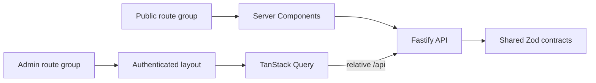

# 🎨 Frontend

The frontend is a Swedish-language Next.js application with two experiences:
a public workshop website and an authenticated admin panel for daily workshop
operations.

It uses the App Router, React Server Components, Tailwind CSS, shadcn/ui and
TanStack Query. Runtime API responses are parsed with schemas from the
workspace's `shared` package.

> [!NOTE]
> Detailed milestones, acceptance criteria and verification records live in the
> [Frontend implementation plan](IMPLEMENTATION_PLAN.md).

## 🚦 Status

**66/96 milestones complete · 8/14 iterations done**

| Remaining area | Progress | Blocker or next step |
|---|---:|---|
| [F2 — Public site](IMPLEMENTATION_PLAN.md#f2) | 5/6 | Add real workshop-owner photographs |
| [F8 — Calendar](IMPLEMENTATION_PLAN.md#f8) | 6/8 | Complete remaining booking acceptance work |
| [F10 — Documents](IMPLEMENTATION_PLAN.md#f10) | 5/6 | Add vehicle-scoped document listing |
| [F11 — Settings](IMPLEMENTATION_PLAN.md#f11) | 0/6 | Build settings, users, rules and partner-link screens |
| [F13 — Admin redesign](IMPLEMENTATION_PLAN.md#f13) | 0/12 | Visual system, shell and dashboard built; the workflow milestones in the [design brief](ADMIN_PANEL_REDESIGN.md) remain |
| [F12 — Polish](IMPLEMENTATION_PLAN.md#f12) | 0/8 | Accessibility, performance and production acceptance |

See the plan's [status table](IMPLEMENTATION_PLAN.md#status) for the complete
iteration map.

F13 adds twelve planned milestones; completed work remains at 66. The redesign
brief records the 2026-09-23 browser observations, screen organization, the
reference-led light palette, mobile behavior, shared/backend dependencies and
acceptance journeys.

**Implemented on 2026-09-23:** the admin token system and category accents, the
grouped navy navigation rail with its account controls, the mobile bottom
navigation and the dashboard's colored operational summaries — F13.2.1, F13.2.5,
F13.3.1, F13.4.1 and F13.4.4. **No F13 milestone is complete**, because each one
still has tasks that depend on new shared/backend contracts (F13.1), on the dark
appearance preference, or on the calendar, booking-form, work-order, register and
inventory workflow changes. A redesigned surface is not a delivered workflow.
Iteration IDs are stable, so F13 intentionally precedes F12 acceptance.

## ✨ Experiences

### Public site

- Swedish service, about, contact and privacy pages
- Registration-number vehicle lookup
- Public booking-request flow with recovery and anti-spam handling
- Responsive, low-JavaScript pages with server-rendered metadata

### Admin panel

- Login, session lifecycle and role-aware actions
- Dashboard and global search
- Customer and vehicle registers
- Inventory, stocktake and low-stock reporting
- Booking inbox, calendar and telephone booking
- Work orders, quotes, protocols and PDF viewing
- Settings and service-rule areas as the remaining planned delivery

## 🏗️ Application shape



- Public pages fetch on the server and ship minimal client JavaScript.
- Interactive admin screens use TanStack Query for caching, mutation and
  optimistic updates.
- Browser requests use the relative `/api` path.
- Server Components use `INTERNAL_API_URL` and call Fastify directly.
- The authenticated admin layout verifies the session server-side.
- There is deliberately no `app/api/`; Caddy owns `/api/*` in production.

## 📂 Structure

```text
frontend/
├── src/
│   ├── app/
│   │   ├── (public)/   Public pages and booking flow
│   │   └── (admin)/    Login and authenticated admin routes
│   ├── components/
│   │   ├── ui/         Reusable primitives
│   │   ├── public/     Public-site components
│   │   └── admin/      Workshop application components
│   ├── lib/            API client, queries, schemas and formatters
│   ├── styles/         Global styles and design tokens
│   └── fonts/          Self-hosted font assets
├── e2e/                Playwright browser journeys
├── next.config.ts
├── playwright.config.ts
└── Dockerfile
```

## 🧭 Main routes

| Area | Routes |
|---|---|
| Public | `/`, `/tjanster`, `/om-oss`, `/kontakt`, `/boka` |
| Authentication | `/admin/logga-in` |
| Dashboard | `/admin` |
| Customers and vehicles | `/admin/kunder`, `/admin/fordon` |
| Inventory | `/admin/lager` |
| Booking | `/admin/bokningar` |
| Work and documents | `/admin/arbetsordrar` and nested quote/protocol routes |
| Settings | `/admin/installningar` |

All customer-facing labels and messages are Swedish. Code, identifiers and
developer documentation remain English.

## 🚀 Running locally

Follow the repository [first-run guide](../README.md#getting-started) to start
PostgreSQL, migrate and seed the backend.

From the repository root:

```bash
# Recommended: shared, backend and frontend together
pnpm dev

# Frontend only; requires shared to be built and an API to be available
pnpm --filter shared build
pnpm --filter frontend dev
```

Open <http://localhost:3000>. Development rewrites keep browser calls on the
same relative `/api` path used in production.

## 🧰 Commands

```bash
pnpm --filter frontend dev
pnpm --filter frontend build
pnpm --filter frontend start
pnpm --filter frontend typecheck
pnpm --filter frontend test
pnpm --filter frontend test:watch
pnpm --filter frontend test:e2e
```

Use `pnpm check` at the repository root for the complete typecheck, lint, test
and type-coverage gate.

## 🎨 Design system

- Tailwind tokens define both the public and admin palettes.
- Admin theme scope also reaches portals such as dialogs, sheets and popovers.
- shadcn/Radix primitives live under `src/components/ui/`.
- `src/components/admin/status.ts` is the single source for admin status
  labels, icons and colors.
- Layouts are mobile-first; data tables provide deliberate compact views.
- Motion communicates hierarchy and state without blocking interaction.
- Loading, empty and error states are required for every data-backed surface.

The detailed design direction and its historical acceptance evidence remain in
the [implementation plan](IMPLEMENTATION_PLAN.md#design-direction). The
completed cross-cutting review is recorded in
[`UI_UX_AUDIT.md`](UI_UX_AUDIT.md).

The admin design is specified in
[`ADMIN_PANEL_REDESIGN.md`](ADMIN_PANEL_REDESIGN.md) and tracked as F13.
`PROJECT_SPEC.md` §9.8 scopes the changes to admin surfaces; the existing public
design and domain-status meanings remain in force.

Its visual half is now in the application. The admin panel is a **light, colorful
workspace**: a deep navy navigation rail (`--color-navy`) against a pale canvas
(`--color-canvas`), white work panels, pastel overview cards and a warm orange
principal action. Section identity comes from a **category-accent** family
(`--color-cat-*`, `components/admin/accent.tsx`) that is deliberately separate
from the status tokens — a violet work-order icon is not a violet status, and a
rose customer icon is not an error. `components/admin/status.ts` remains the only
authority on what a colour means. Every pair was measured with `lib/contrast.ts`
before it was written down, and `/admin/styleguide` re-measures them live.

## 🔄 Data and forms

- Never cast an API response; parse it with its shared Zod schema.
- Use Server Components by default and add `'use client'` only for interaction.
- Public data loads on the server; admin data uses TanStack Query.
- React Hook Form handles interactive forms with shared validation contracts.
- Money arithmetic, unit conversion and state transitions stay in `shared`.
- Optimistic mutations must define rollback and error behavior.

## 🧪 Testing

```bash
# Unit tests for frontend helpers and behavior
pnpm --filter frontend test

# Browser journeys against the running application
pnpm --filter frontend test:e2e
```

Playwright covers public booking, authentication and the main admin journeys.
High-risk flows use the real backend and PostgreSQL where mocks would hide
contract, concurrency or session failures.

## 📐 Conventions

- Use Server Components unless browser interaction requires a client boundary.
- Keep API contracts in `shared`, not duplicated in frontend-only types.
- Keep business calculations out of components.
- Render loading, empty and error states explicitly.
- Use the shared status system rather than hard-coded colors.
- Preserve keyboard navigation, visible focus and reduced-motion behavior.
- Do not create Next.js route handlers under `app/api/`.

## 📚 Related documentation

- [Project overview](../README.md)
- [Product and engineering specification](../docs/PROJECT_SPEC.md)
- [Architecture decisions](../docs/DECISIONS.md)
- [Frontend implementation plan](IMPLEMENTATION_PLAN.md)
- [UI/UX audit](UI_UX_AUDIT.md)
